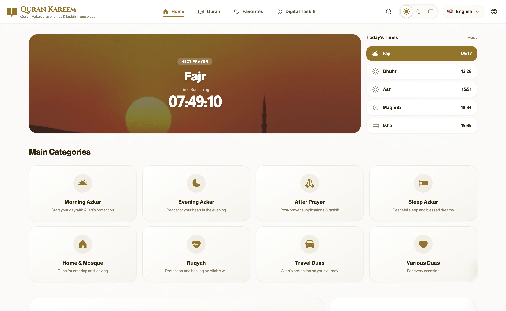
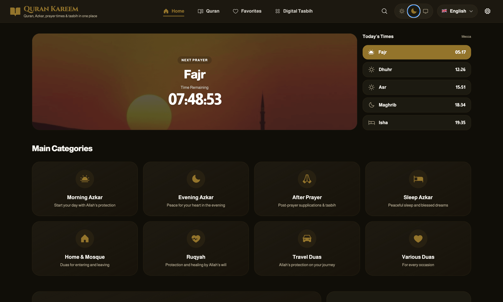
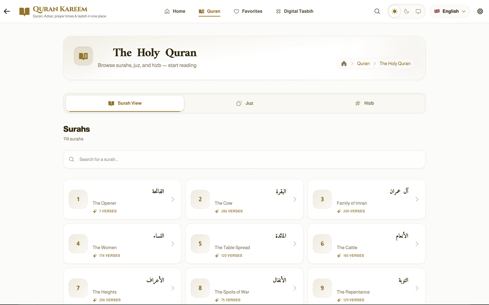
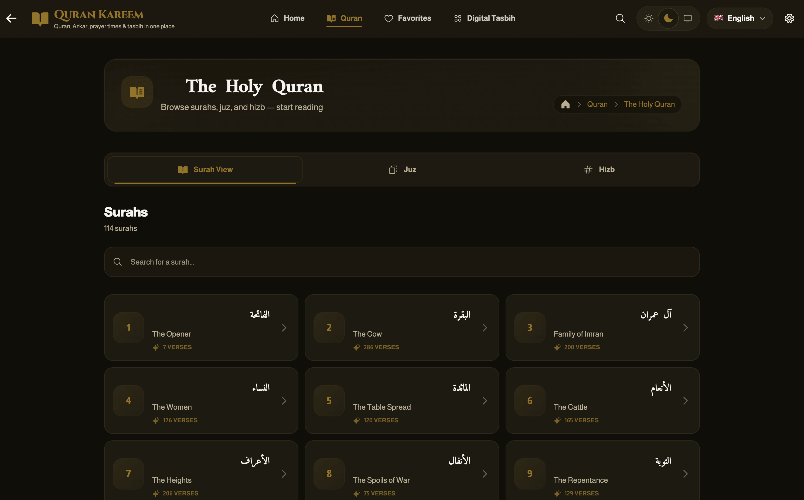
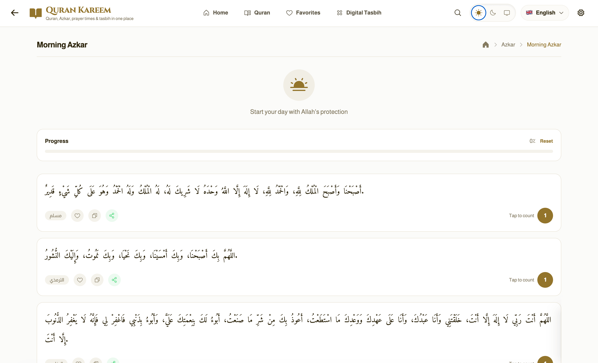
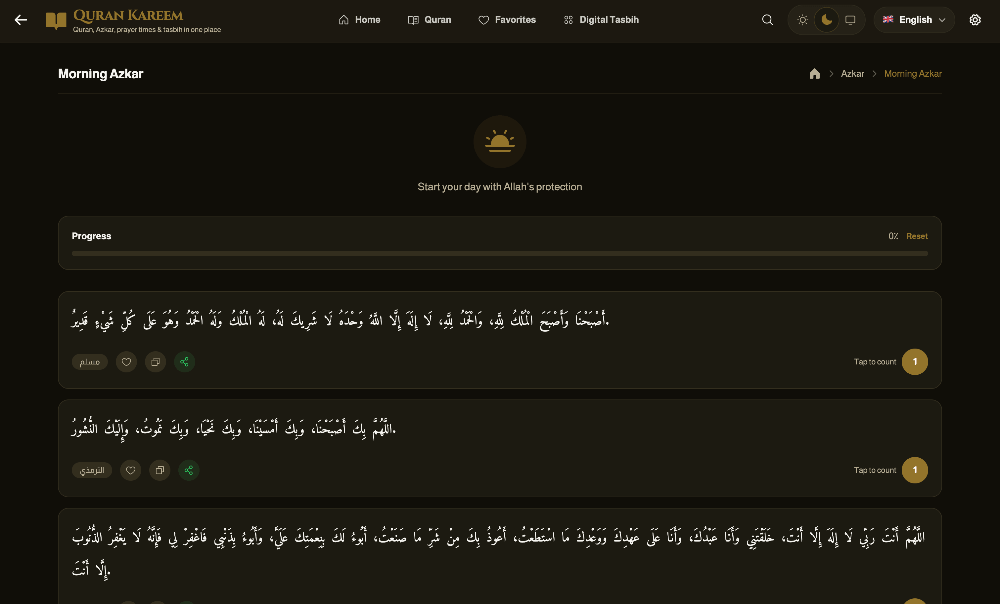
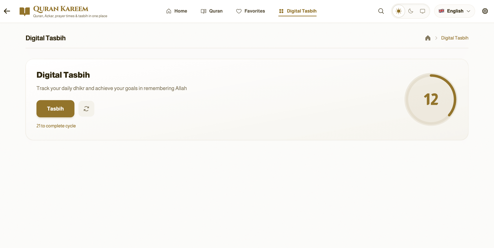
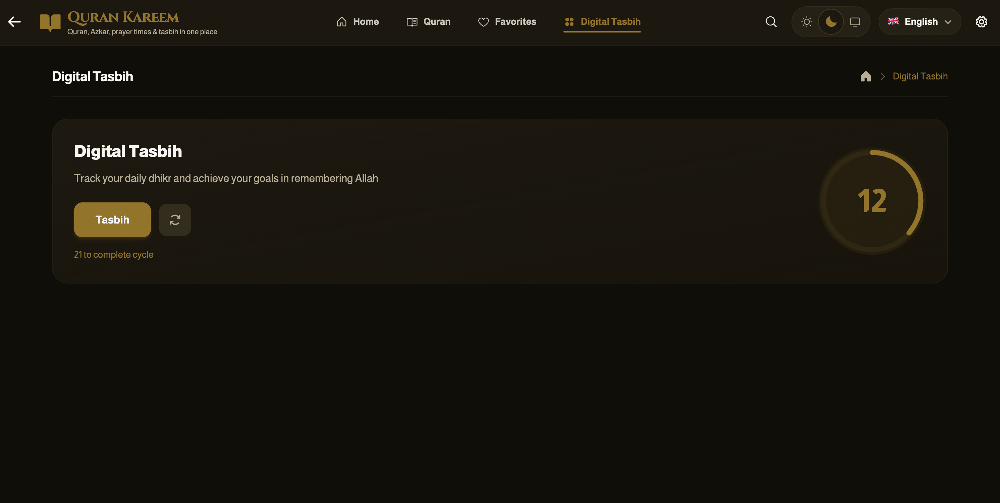
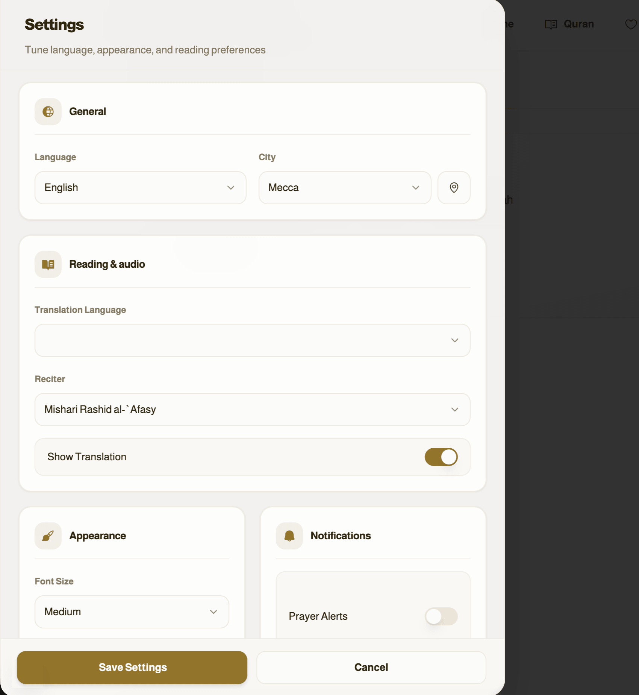
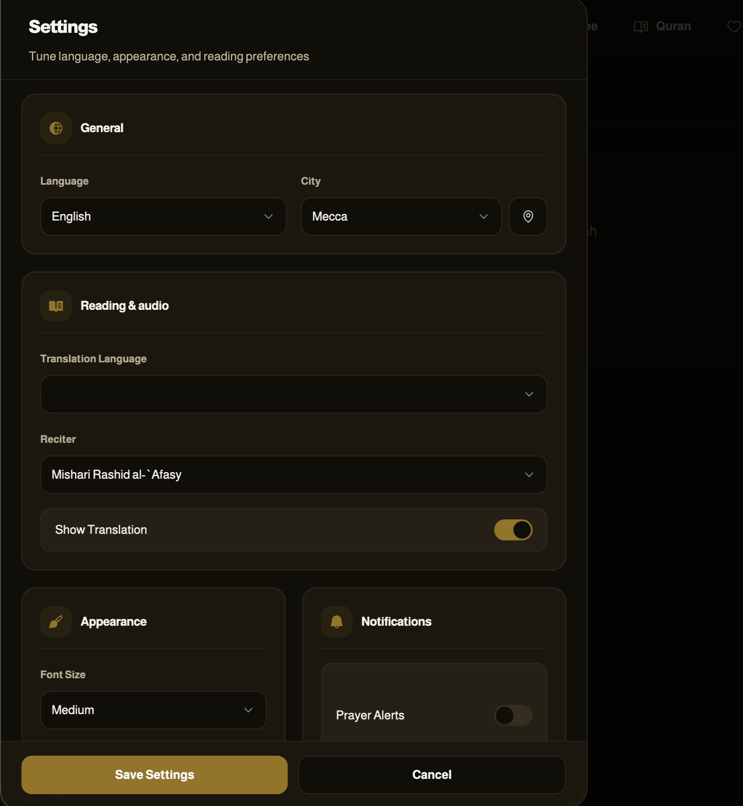

<p align="center">
  
  
  
  
  
</p>

# 🕌 quran kareem

A modern Islamic companion app with Quran reading, audio recitation, prayer times, azkar, tasbih, and progress tracking in a clean bilingual experience.

## Live Preview

[Open the app on GitHub Pages](https://mamdouhramadan.github.io/quran-azkar/)

---

## 📸 App Screenshots

Reference captures of the UI in **light** and **dark** themes (two columns).

<table>
  <tr>
    <td width="50%" align="center"><strong>Home — light</strong></td>
    <td width="50%" align="center"><strong>Home — dark</strong></td>
  </tr>
  <tr>
    <td></td>
    <td></td>
  </tr>
  <tr>
    <td width="50%" align="center"><strong>Quran — light</strong></td>
    <td width="50%" align="center"><strong>Quran — dark</strong></td>
  </tr>
  <tr>
    <td></td>
    <td></td>
  </tr>
  <tr>
    <td width="50%" align="center"><strong>Azkar — light</strong></td>
    <td width="50%" align="center"><strong>Azkar — dark</strong></td>
  </tr>
  <tr>
    <td></td>
    <td></td>
  </tr>
  <tr>
    <td width="50%" align="center"><strong>Digital Tasbih — light</strong></td>
    <td width="50%" align="center"><strong>Digital Tasbih — dark</strong></td>
  </tr>
  <tr>
    <td></td>
    <td></td>
  </tr>
  <tr>
    <td width="50%" align="center"><strong>Settings — light</strong></td>
    <td width="50%" align="center"><strong>Settings — dark</strong></td>
  </tr>
  <tr>
    <td></td>
    <td></td>
  </tr>
</table>

---

## ✨ Highlights

- Read all 114 surahs with elegant Arabic typography and optional English translation.
- Listen to verse-by-verse recitation with playback controls, repeat mode, and multiple reciters.
- Follow daily prayer times with countdowns, highlighted upcoming prayers, and city selection.
- Use built-in azkar collections, favorites, and a digital tasbih experience.
- Track Quran completion progress with bookmarks, khatmah stats, and weekly reading insights.
- Switch between Arabic and English, control font size, and choose light or dark theme.

---

## 🛠️ Tech Stack

- Next.js 16
- React 18
- TypeScript
- Tailwind CSS
- Zustand
- TanStack React Query

---

## 🚀 Getting Started

### Prerequisites

- Node.js 18+
- npm or pnpm

### Installation

```bash
# Clone the repository
git clone <repository-url>

# Navigate to project directory
cd <repository-folder>

# Install dependencies
npm install

# Run development server
npm run dev
```

Open [http://localhost:3000](http://localhost:3000) in your browser.

### Build for Production

```bash
npm run build
npm start
```

---

## 📄 License

This project is licensed under the MIT License.
